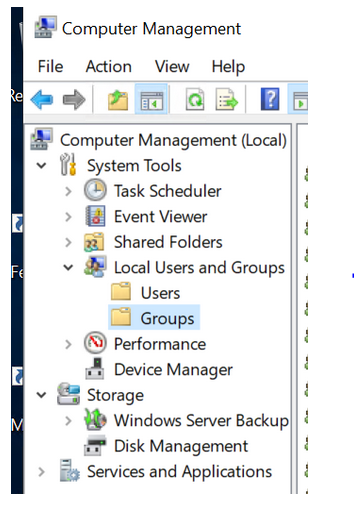

<h1 align="center">  3. Eguneko ariketa:
Laborategi baterako kudeaketa: Windows-eko makina bat kudeatzen.</h1>

## Sarrera:
Windows makina bat kudeatzeko konfigurazio pausuak burutu ditugu. Hurrengo ariketan, irakasteko laborategi baten kudeaketa gauzatuko dugu. 

Ariketa honen bidez, kasu errealetan burutu behar diren atazak beteko ditugu eta aldi berean Ansible-ek duen potentziala ikusiko dugu. 

Horretarako Playbook bat osatu beharko duzue, non "task" (edo eginkizun) ezberdinen bitartez hurrengo atazak bete beharko diren:

* “**Ariketa_1**” izeneko karpeta bat sortu “**C:/**” diskoaren barruan. 

* Instalatu “**Git**”, “**Google Chrome**” eta “**VSCode**”.

* Sortu erabiltzaile talde bat “Ikasleak” izenarekin.

* Sortu erabiltzaile berri bat “Ikasle_(zuenIzena)” 
deiturikoa. 

    * Erabiltzaile hau, sortu berri duzun taldearen parte (“Ikasleak”) eta “Remote Desktop Users” taldeen parte ere izan behar du.

 

   
Laguntza: 3 eta 4 puntuak baieztatzeko. 

 
 * 3\. eta 4. puntua baieztatu nahi izan ezkero, “**Computer Management**” leihoa irekiko dugu. "**Groups**" karpetan dena ondo sortu dela egiaztatzeko.

 

   
Laguntza: Atazak burutzeko galduta bazaude. 

 Atazen bat burutzeko galduta bazaude esteka honetako bideoak ikusi: https://rb.gy/fspcet .

